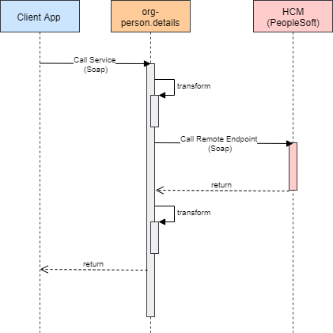

# person.details

The person.details API is a service that connects to the downstream Peoplesoft Campus.
It has the following functionalities:
Retrieve Person data 

Jira Migration Ticket
https://jira.adelaide.edu.au/browse/IOO-208

**Diagram**

## Migration guide to OpenShift

Please Follow the steps outlined here : Migrating to SpringBoot
https://wiki.adelaide.edu.au/its/System_Integration/SpringBoot/DetailMigratingStepstoSpringBoot 

## Build and Run the service locally
The assumption is you already have a working maven installation in your path.
You can run the service in 2 ways:

Using the Maven plugin to your Spring boot app. (recommended way)

 mvn spring-boot:run -DJASYPT_PWD=<https://thycotic.ad.adelaide.edu.au/app/#/secret/3533/general> -DPROXY_SECRET_TOKEN=<https://thycotic.ad.adelaide.edu.au/app/#/secret/3534/general> -DSPRING_CONFIG_LOCATION="classpath:application.properties,classpath:application-dev.properties" -DSPRING_PROFILES_ACTIVE=dev

You can also run using java -jar < jar_file_here >. Dont forget to set the environment parameters.

java -jar target/< jar_file_here > --environment_parameters=...
The postman scripts found in src/test/postman provides more information on how to test the service.

## Security and RH-SSO settings
Create a client person-details-v1 for the application in RH-SSO if the client doesn't exist. You will need to do this in each RH-SSO environment before deployment.
Ensure that in application profile properties (e.g. application-dev.properties) the keycloak properties are in agreement with the RH-SSO environment settings and with the client you defined for the app.

##### Authorization Server ######
keycloak.realm=uoarealm
keycloak.auth-server-url=https://api-auth-dev.adelaide.edu.au/auth
keycloak.resource=person-details-v1
keycloak.credentials.secret=ENC(<encrypt using JASYPT password>)
For further details on SB application security consult the ClientAuthorizationUsingOAuthAndRHSSO Wiki guide.

##Building and Deploying in OpenShift

Please Follow the steps outlined here : 
https://wiki.adelaide.edu.au/its/System_Integration/SpringBoot/DetailMigratingStepstoSpringBoot#Pipeline.Deployment

## Changelog
- October 2021, [IN-1326](https://jira.adelaide.edu.au/browse/IN-1326): Prometheus related changes for Persson Details
    * Updated `pom.xml` to include dependencies for Prometheus monitoring and incremented version
    * Updated property - `management.endpoints.web.exposure.include` in `application.properties` to include `prometheus`
    * Updated jenkins namespace in step Load environment config.
    * Update postman test case in "REST Success12",  commented assetion #4 in second test

